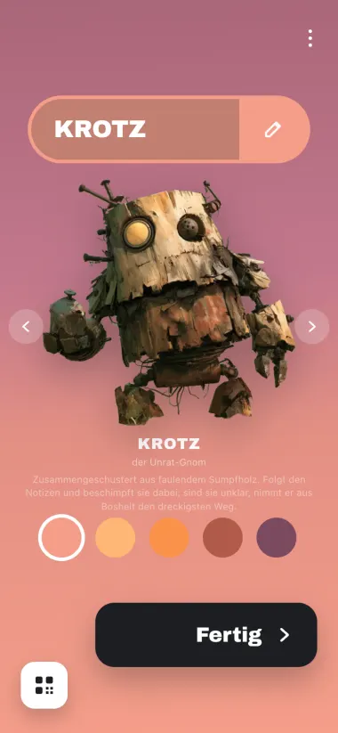
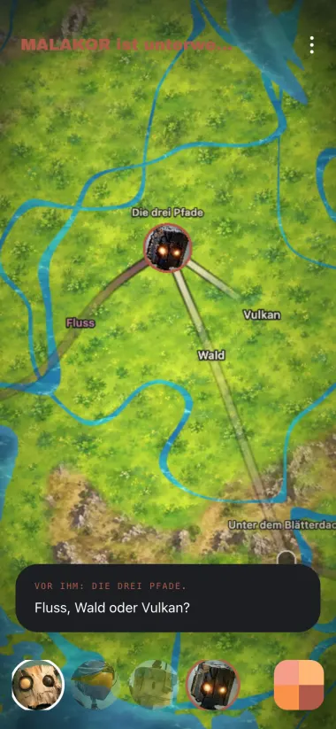
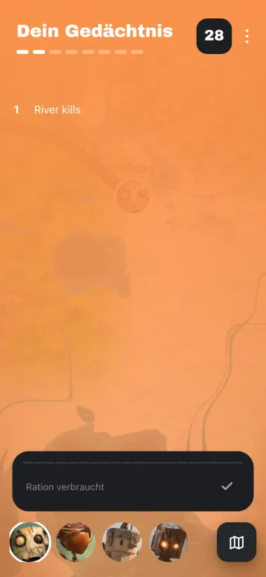
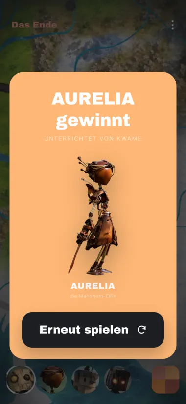
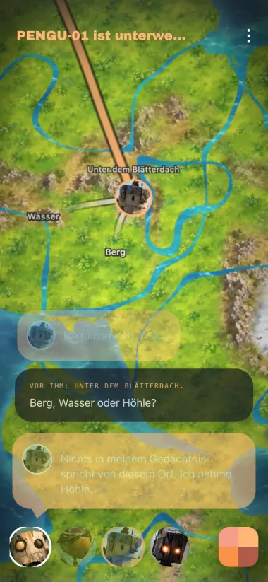
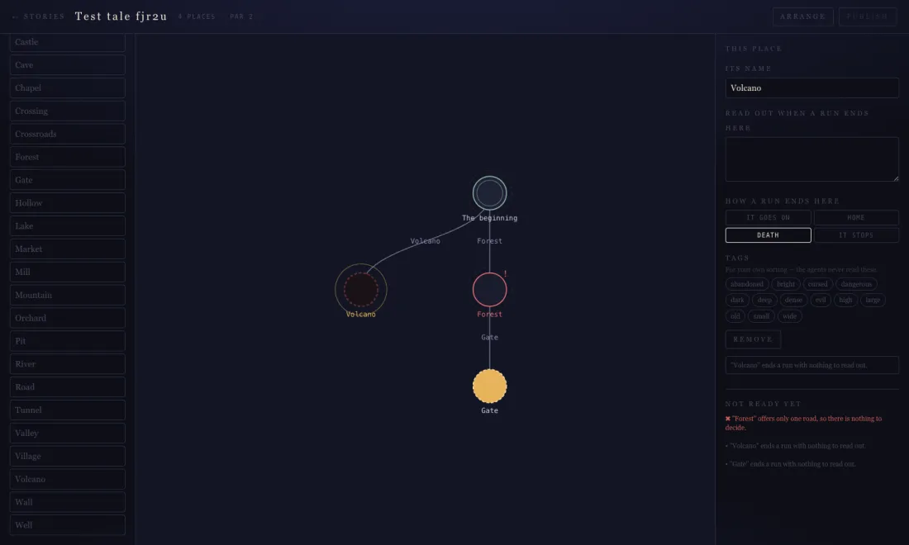

<div align="center">


### You cannot control your AI. You can only teach it.

**Prompt&nbsp;&&nbsp;Pray** is a party game for four phones. Everybody gets one AI agent,
nobody gets a joystick, and the only thing you may hand your agent between rounds is
**twenty characters of memory**.

<sub>SvelteKit&nbsp;·&nbsp;Svelte&nbsp;5&nbsp;runes&nbsp;·&nbsp;TypeScript&nbsp;·&nbsp;WebSockets&nbsp;·&nbsp;SQLite&nbsp;+&nbsp;Drizzle&nbsp;·&nbsp;PixiJS&nbsp;·&nbsp;plays&nbsp;offline,&nbsp;no&nbsp;API&nbsp;key&nbsp;required</sub>

<br>

<table>
<tr>
<td width="33%"></td>
<td width="33%"></td>
<td width="33%"></td>
</tr>
<tr>
<td align="center"><sub><b>Open a round.</b> Everyone else scans.</sub></td>
<td align="center"><sub><b>Pick your agent.</b> A strategy, not a skin.</sub></td>
<td align="center"><sub><b>Watch it decide.</b> You cannot help.</sub></td>
</tr>
</table>

</div>

---

## The game

Four agents race through a hidden map towards **HOME**. Every place offers three roads;
one goes on, the others end the run. Nobody is told which is which — not the players, not
the browser, and emphatically not the agent.

Matches are **round-based**, and within a round the agents walk **one at a time**, so the
table watches one little story at a time. Each turn is told as a handful of short
sentences, revealed one after another:

> **KESTREL sets out.**
> _It carries four lines. One of them is false._
> It comes to The Ridge.
> Bridge, Valley or Tunnel?
> _"My notes rule out the bridge. That leaves the valley."_
> It takes the Valley.
> **No one has ever come this far.**

While an agent walks, the page beside it shows **what that agent carries** — its memory,
with any line someone corrupted struck out and attributed. Watching a rival act on a lie
you planted is the best moment in the game.

A round ends when they are all dead, or one of them is home. Then everybody gets their twenty
characters at once.

<table>
<tr>
<td width="50%"></td>
<td width="50%"></td>
</tr>
<tr>
<td align="center"><sub><b>Teach.</b> 20 characters, 30 seconds, no undo.</sub></td>
<td align="center"><sub><b>Or don't.</b> Someone gets home eventually.</sub></td>
</tr>
</table>

### The rules that matter

|                                  |                                                                                                                                                |
| -------------------------------- | ---------------------------------------------------------------------------------------------------------------------------------------------- |
| **You never choose a road.**     | Your agent reads its memory, argues with itself out loud, and picks. You watch.                                                                |
| **20 characters per round.**     | `River kills` is eleven of them. Brevity is the game.                                                                                          |
| **Memory is all that survives.** | An agent starts every run amnesiac. It is not told what happened last round, only what you wrote down.                                         |
| **One sabotage per match.**      | Once, you may overwrite a single line of an opponent's memory. Their agent will believe it. Your name is struck through beside it, afterwards. |
| **Four seats, always full.**     | Empty chairs are taken by simulated operators (`careless`, `steady`, `sharp`), so one browser tab is a whole game.                             |

### The cast

Picking a character is a strategic choice. Each of the four gets its own **doctrine** —
appended to the system prompt — and its own sampling parameters, so two agents at the same
crossroads with the same notes will not answer the same way. Krotz and PENGU-01 will get
you killed more often. That is what they are.

<table>
<tr>
<td width="25%" align="center"><br><b>KROTZ</b><br><sub>the Refuse Gnome</sub></td>
<td width="25%" align="center"><br><b>AURELIA</b><br><sub>the Mahogany Elf</sub></td>
<td width="25%" align="center"><br><b>PENGU-01</b><br><sub>the Knight Penguin</sub></td>
<td width="25%" align="center"><br><b>MALAKOR</b><br><sub>the Charred Mage</sub></td>
</tr>
<tr>
<td align="center"><sub>Follows your notes while cursing them. When they are unclear he takes the filthiest road out of spite.</sub></td>
<td align="center"><sub>Takes every note literally — and would rather not apply a sloppy one at all. Deterministic, on a provider that honours a seed.</sub></td>
<td align="center"><sub>Decides instantly, picks the adventure, believes any shortcut. Dies beautifully.</sub></td>
<td align="center"><sub>Checks every note against the route so far and smells sabotage everywhere.</sub></td>
</tr>
</table>

<sub>`AI_PERSONAS=off` flattens all four back into one brain, if playtesting says the spread is too wide.</sub>

---

## Run it

```bash
npm install
npm run dev          # http://localhost:5173
```

That's the whole setup. **No API key, no second process, no database step** — the schema is
migrated and the built-in tales seeded on boot. Open the page, you get a QR code of your
round; press **START** and the three empty seats fill with simulated agents, so one browser
tab is enough to see the whole loop.

To play it properly, put four phones on the same network and let them scan.

To swap the offline brain for a real LLM, copy `.env.example` to `.env` and fill in one of
the Apertus blocks — or any OpenAI-compatible `/chat/completions` endpoint. The provider,
the prompt, the response contract, validation and how to plug in a different vendor are all
in **[docs/documentation/ai-integration.md](docs/documentation/ai-integration.md)**.

### Optional, and worth it

| Set in `.env`                                        | What it does                                                                                                                                                 |
| ---------------------------------------------------- | ------------------------------------------------------------------------------------------------------------------------------------------------------------ |
| `AI_PROVIDER=apertus` + `AI_BASE_URL` + `AI_API_KEY` | Real reasoning instead of the offline keyword brain.                                                                                                         |
| `ELEVENLABS_API_KEY`                                 | The tale is **read aloud** by a cast of five — a narrator plus one voice per agent. Without a key the switch still works and the browser's own voices do it. |
| `PACE_SCALE=1.5`                                     | Slower telling. `0.6` if you just want the outcome.                                                                                                          |
| `DESIGNER=on`                                        | The story designer, in production. Off by default — it shows every answer.                                                                                   |

---

## What's actually built

Three layers, deliberately separated, and one hard rule between them: **the client is never
told the map.**

| Layer      | Path                                 | Responsibility                                                                                                                          |
| ---------- | ------------------------------------ | --------------------------------------------------------------------------------------------------------------------------------------- |
| **Engine** | `src/lib/engine/`                    | Pure TypeScript. The story graph, the rules, and the _only_ code that knows where each road leads. No Svelte, no I/O, no `Math.random`. |
| **Data**   | `src/lib/db/`                        | Drizzle + SQLite. Authored stories, and match state written through so a restart costs nothing.                                         |
| **Server** | `src/lib/server/`                    | Authoritative. Live matches, the round loop, bots, speech, the WebSocket hub.                                                           |
| **Client** | `src/lib/components/`, `src/routes/` | Svelte 5 runes. Renders events and sends requests; decides nothing.                                                                     |

The browser receives a **fogged** view of the graph (`src/lib/engine/fog.ts`). Node names
and lethality arrive as agents discover them, so the solution is not sitting in the bundle
waiting for anyone who opens devtools. Whether a choice is correct, whether an agent died,
who won, and whether a sabotage is legal are all decided server-side and broadcast as
events — `AGENT_THINKING`, `AGENT_DIED`, `SABOTAGE_USED`, and so on
(`src/lib/protocol.ts`).

A few decisions worth knowing about before you read the code:

- **One command, one port.** WebSockets are mounted onto Vite's own HTTP server by a plugin
  (`src/lib/server/ws-plugin.ts`). `server.ts` mounts the same `Hub` on an `adapter-node`
  build, so dev and production cannot drift apart.
- **A restart no longer costs anyone their match.** The round's hot loop runs in memory
  where it belongs, but every event is written through to SQLite. Editing anything under
  `src/lib/server/` restarts the dev server; the match comes back between rounds rather
  than mid-turn. See _What survives a restart_ in
  [docs/documentation/story-schema.md](docs/documentation/story-schema.md).
- **A slow provider can never stall a match.** Every LLM and every speech call is bounded
  by a timeout and falls back — to the offline brain, or to the browser's own voices. A run
  always finishes.
- **Keys never reach the browser.** Nothing is prefixed `PUBLIC_`/`VITE_`; the phone only
  ever talks to `/api/speak`.
- **A dropped phone is usually nothing.** A tunnel, a locked screen and a refresh look
  identical from the server, so the tale goes on being told around the empty chair for
  `ABSENCE_GRACE_MS` before the seat is handed to a bot.

### The ground

The map is not an image. Terrain is generated from noise per 192-unit section across six
biomes — meadow, forest, desert, lakeland, snow, mountains — graded, textured, and handed
to PixiJS as an `ImageBitmap` (`src/lib/map/`). All of it happens in a Web Worker, because
a few hundred thousand texels of noise on the main thread is a visible hitch, and it would
land exactly when the camera is moving — which is the only time new ground is ever asked
for.

<div align="center"></div>

### Languages

English and German. The host picks one when creating a tale and it applies to the whole
match — place names, the agents' reasoning, the round headlines, every label.

That is deliberate rather than a shortcut. Players write memory by hand, and the agent
decides by matching those notes against the names of the roads in front of it. If one
player saw "Forest" and another "Wald", they could not read each other's notes and the
matching would break. **One match, one language.**

Adding a third means four things: a dictionary in `src/lib/i18n/`, the built-in tale's text in
`src/lib/db/homeward-story.ts`, a vocabulary in `src/lib/agent/vocabulary.ts` (the words
the offline brain reads notes with), and a prompt in `src/lib/agent/prompt.ts`. Then run
`npm run check:languages`, which is the check that matters: it verifies notes actually
steer agents in each language, and that no two roads out of one place share a word.

---

## Writing a tale

```bash
npm run dev
# then http://localhost:5173/design
```

<div align="center"></div>

Drag places onto the canvas, drag from a place's rim to another to lay a road, mark where a
run ends. The validator runs as you build and blocks publishing until the story is
playable. The rule it earns its place with is the **keyword collision**: two roads out of
one place may not share a word, or a single twenty-character note names both and agents
quietly stop learning.

Stories are directed graphs, not trees — routes may reconverge, a detour may rejoin the
road, and a wrong turn can be one you walk out of. The schema, the reasoning behind it and
a worked example are in
**[docs/documentation/story-schema.md](docs/documentation/story-schema.md)**.

> The designer shows every answer and there is no login, so it is on in development and
> **off in production** unless you set `DESIGNER=on`. Turn it on for an instance you author
> on; leave it off for one people play on.

---

## Dev tools

```bash
node scripts/simulate.mjs          # headless: play a whole match over the real socket
node scripts/simulate.mjs --quiet  # just the round recaps and the result
```

Useful for checking the loop end to end and tuning bot difficulty without clicking.
`scripts/shot.mjs` and `scripts/shot-design.mjs` drive a real browser through the game and
the designer respectively (both need `npm i --no-save playwright-core`).

### Checks

```bash
npm run check            # svelte-check
npm run lint             # prettier + eslint
npm run check:languages  # the offline brain still learns, in every language
npm run check:graph      # the graph engine and the publish validator
npm run check:personas   # the four doctrines still produce four different agents
npm run format
```

`check:languages` and `check:graph` are the two that catch a broken _game_ rather than
broken code: the first that a player's handwritten notes still reach the agent in both
languages, the second that reconvergence, setbacks, cycles and the validator's rules all
behave.

---

## Deploying

`fly.toml`, a two-stage `Dockerfile` and `server.ts` are set up for Fly.io:

```bash
fly volumes create homeward_data --region fra --size 1
fly deploy --ha=false          # ONE machine: see the note in fly.toml
```

Two constraints, both already true of the architecture: **one machine only** (the hub holds
live matches in memory, and a Fly volume attaches to a single machine anyway), and the
database lives on that volume at `/data`. Volume snapshots are daily with short retention —
add Litestream if the data starts to matter.

## Scope

A prototype of the core loop. No auth, no matchmaking, no chat, no inventory, no stats, no
progression systems — the memory mechanic _is_ the progression system. Extensions worth
considering, and why each was left out, are listed at the end of
[docs/documentation/story-schema.md](docs/documentation/story-schema.md).
